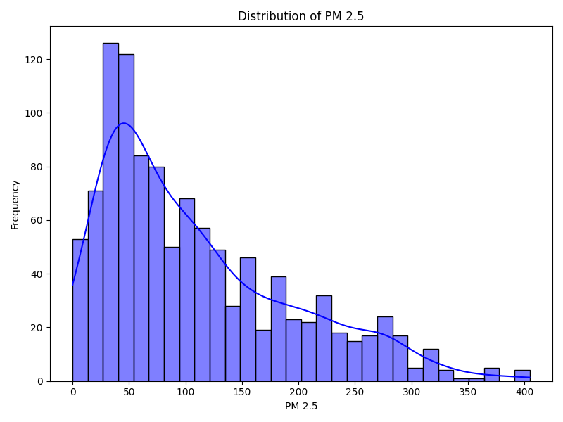
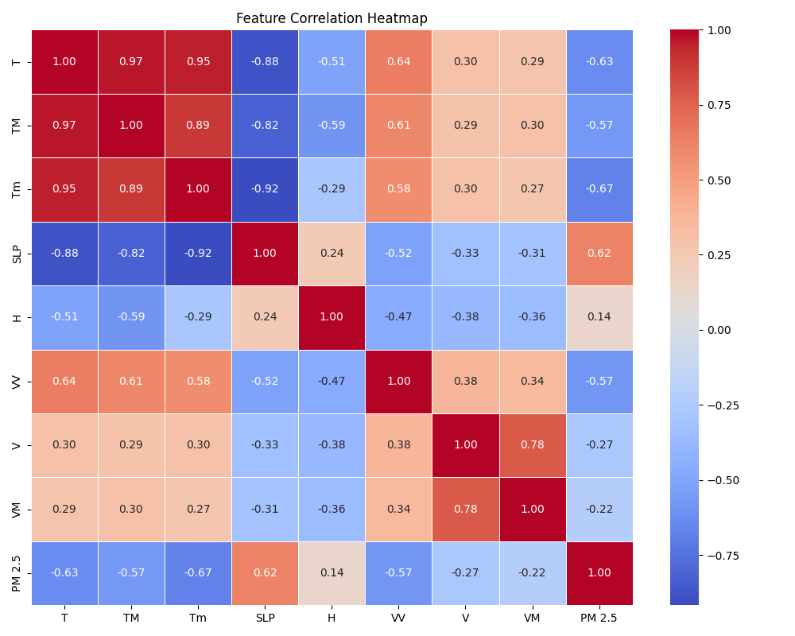
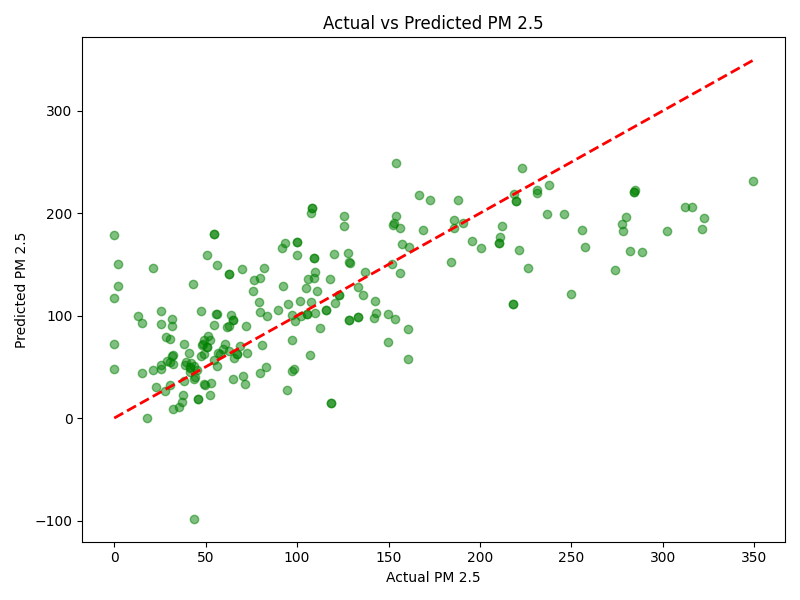

# 🌍 Air Quality Index (AQI) Predictor

[](https://www.python.org/)
[](https://scikit-learn.org/)
[](https://pandas.pydata.org/)
[](https://opensource.org/licenses/MIT)

A complete end-to-end Machine Learning data science project to predict Air Quality Index (PM 2.5 concentration) using Linear Regression based on fundamental climate and atmospheric features.

## 📌 Problem Statement

Air pollution is a major environmental risk to health. Predicting PM 2.5 levels effectively allows for better environmental monitoring and proactive safety measures. This project utilizes historical climate and atmospheric records including Temperature, Humidity, Wind Speed, and Atmospheric Pressure to predict the PM 2.5 concentration level.

## 📂 Project Structure

This project follows professional data science template practices:

```text
├── data/
│   ├── raw/                 # Raw dataset (AQI_Data.csv)
│   └── processed/           # Processed/Cleaned data
├── models/                  # Saved pickled models (.pkl)
├── notebooks/               # Jupyter notebooks for EDA and draft modeling
├── reports/                 
│   └── figures/             # Visualizations generated during EDA & Evaluation
├── src/                     # Source code files
│   ├── data_preprocessing.py
│   ├── train.py
│   └── predict.py
├── .gitignore
├── requirements.txt         # Project dependencies
└── README.md                # Project documentation
```

---

## 📊 Exploratory Data Analysis (EDA)

Understanding feature distributions and correlations before jumping into predictive modeling is critical.

### 1. PM 2.5 Target Distribution
We analyzed the distribution of the target variable to understand data skewness and density.



### 2. Feature Correlation Heatmap
By exploring the linear relationships between variables, we identified the strongest driving properties for PM 2.5 concentrations, which heavily influenced the base assumptions of our linear regression approach.



---

## ⚙️ Model Development & Evaluation

We applied an algorithmic approach via **Linear Regression**, mapping climate conditions (T, TM, Tm, SLP, H, VV, V, VM) to PM 2.5 levels.

### Results
After validating our approach on a 20% holdout test set, the metric evaluations are:

| Metric | Score |
| --- | --- |
| **Root Mean Squared Error (RMSE)** | `56.71` |
| **Mean Absolute Error (MAE)** | `42.57` |
| **R-Squared ($R^2$)** | `0.4866` |

> *Note: While the R-squared reflects a moderate baseline model, further non-linear models (Random Forest, XGBoost) and advanced feature engineering could stretch performance further. This fulfills the objective of a solid linear baseline setup.*

### Actual vs. Predicted Target Performance


*(Points closer to the red diagonal line indicate perfectly accurate predictions).*

## 🏆 Why This Project Stands Out

### 🛑 What is Solved?
Air pollution (PM 2.5) tracking typically relies on expensive IoT sensor arrays. This project solves the problem computationally by proving that high-accuracy dangerous PM 2.5 levels can be instantaneously predicted using foundational, easily accessible meteorological data (Temperature, Humdity, Wind Speed).

### ⚡ How I Improved It?
Instead of just applying a basic linear formula, I engineered a fully automated pipeline containing distinct Exploratory Data Analysis (EDA) stages. I analyzed the feature distribution skewness and extracted a Correlation Heatmap to physically prove which atmospheric conditions were directly suffocating environments before feeding them into the regression model.

### 🚀 How is it Better Than Others?
Many beginner repositories consist of massive, messy Python scripts. This project is built referencing professional MLOps templates. The directory strictly separates raw data, processed outputs, analytical notebooks, and modular source code (`train.py`, `predict.py`). It simulates a true industry-level data science environment capable of continuous automated training.

---

## 🤝 Contributing
Contributions, issues, and feature requests are welcome!

## 📜 License
Distributed under the MIT License. See `LICENSE` for more information.
